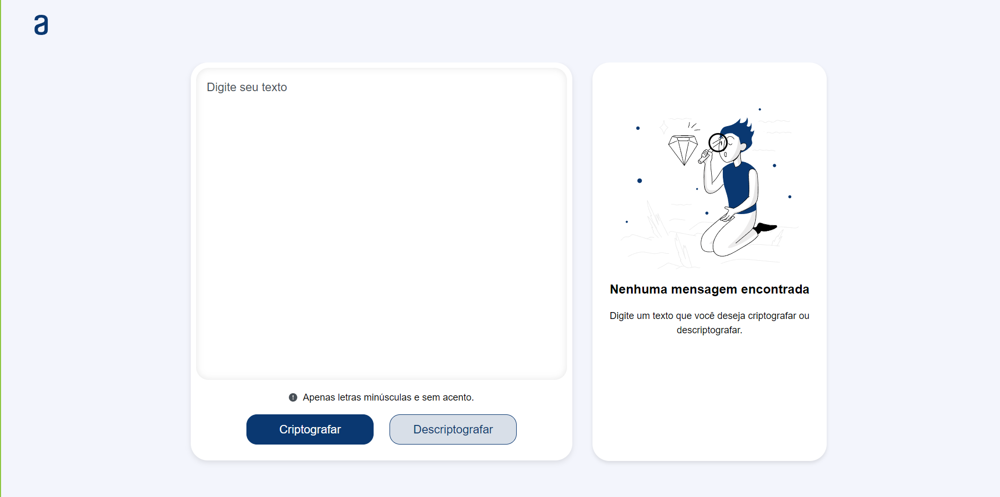
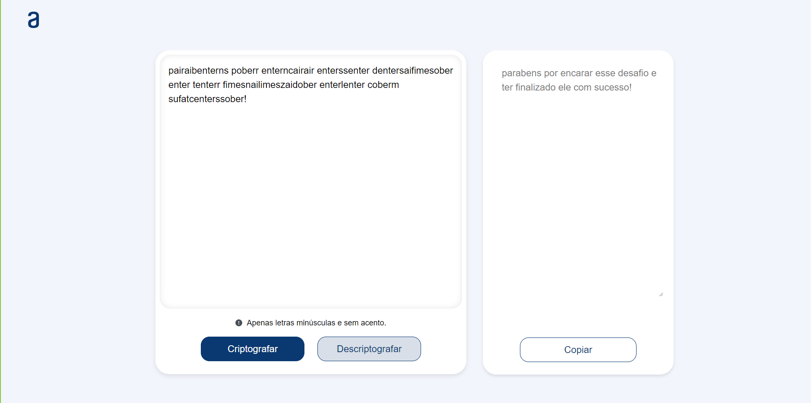

# Decodificador de texto
Challenge ONE

## Resumo do Projeto:

Olá! Neste projeto, desenvolvi um Decodificador de Texto, uma aplicação web que permite a criptografia e a descriptografia de palavras. Este trabalho é parte do desafio proposto pelo programa Oracle Next Education - ONE, em parceria com a Alura.

O Decodificador utiliza um método simples de substituição para transformar texto. As regras de criptografia são as seguintes:

~~~
As "chaves" de criptografia que utilizaremos são:
  A letra "e" é convertida para "enter"
  A letra "i" é convertida para "imes"
  A letra "a" é convertida para "ai"
  A letra "o" é convertida para "ober"
  A letra "u" é convertida para "ufat"
~~~

**Requisitos:** 

A aplicação deve funcionar exclusivamente com letras minúsculas, sem acentos ou caracteres especiais. O usuário pode inserir um texto e escolher entre as opções de criptografar ou descriptografar, com o resultado exibido na tela.

**Extras:**  

Para aprimorar o meu Decodificador de Texto, implementei algumas características adicionais que melhoram a experiência do usuário:

**1. Botão de Copiar:**
Adicionei um botão que permite ao usuário copiar o texto criptografado ou descriptografado. Isso facilita o compartilhamento do resultado sem a necessidade de seleção manual.

**2. Verificação de Mensagens:**
Implementei uma verificação que altera o layout da interface com base na interação do usuário. O funcionamento é o seguinte:

+ Nenhuma Mensagem Encontrada: Se o usuário não tiver criptografado ou descriptografado nenhuma palavra ou frase, a interface exibirá a mensagem: "Nenhuma mensagem encontrada". Isso proporciona um feedback claro e orienta o usuário sobre a necessidade de inserir um texto.
+ Resultado Disponível: Quando o usuário criptografa ou descriptografa uma palavra ou frase, o layout é atualizado para exibir o resultado. Além disso, um botão de copiar é apresentado, permitindo que o usuário obtenha o texto resultante de forma rápida e prática.

## Resultado do Projeto:

**1. Layout inicial:**

**2. Layout com Texto criptografado/descriptografado:**

**Próximos Passos:**

Embora o projeto atenda aos requisitos básicos no momento, tenho planos para aprimorá-lo ainda mais:

__1. Responsividade:__ Adicionar estilos responsivos para garantir uma ótima experiência em diferentes dispositivos e tamanhos de tela.
 __2. Novas Funcionalidades:__ Implementar novos recursos que agreguem valor e melhorem a usabilidade da aplicação.
 __3. Refatoração do Código:__ Revisar e refatorar o código para torná-lo mais limpo, modular e escalável.
 __4. Testes e Depuração:__ Adicionar testes unitários e de integração para garantir a estabilidade e identificar possíveis problemas.
 __5. Documentação:__ Criar uma documentação abrangente, incluindo instruções de instalação, uso e contribuição.

Essas melhorias futuras visam transformar este projeto em uma aplicação mais robusta, eficiente e fácil de manter. Nesta versão revisada, organizei melhor as informações, adicionei subtítulos para clareza e corrigi alguns erros de digitação. Espero que esta versão aprimorada transmita suas intenções de forma mais efetiva.